# 实验一 进程、线程相关编程实验

## 1.0 华为云环境搭建
1. 问题：使用ssh远程连接服务器失败

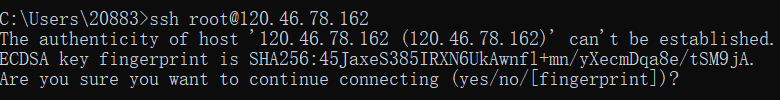

初步解决：输入yes，然后回车即可
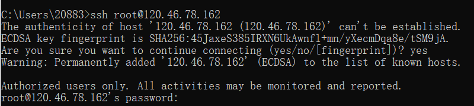

最终解决：修改配置文件

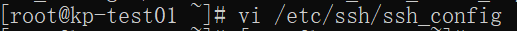

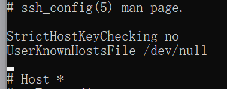

参考资料：[解决The authenticity of host can’t be established ECDSA key fingerprint is SHA256](https://blog.csdn.net/aliyunbaike/article/details/119665377)  

2. 使用当前环境编译并运行一个程序


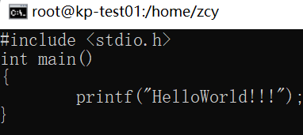

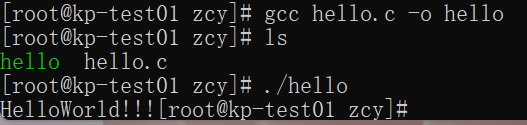
<br>运行成功

## 1.1 进程相关编程实验
### 实验步骤
1.编写并多次运行图 1-1 中代码  
```c
int main()
{
    pid_t pid,pid1;
    pid=fork();
    if(pid<0){
        fprintf(stderr,"Fork Failed");
        return 1;
        }
    else if(pid==0){
        pid1=getpid();
        printf("child:pid=%d ",pid);
        printf("child:pid1=%d ",pid1);
        }
    else {
        pid1=getpid();
        printf("parent:pid=%d ",pid);
        printf("parent:pid1=%d ",pid1);
        wait(NULL);
        }
    printf("\n");
    return 0;
}
```
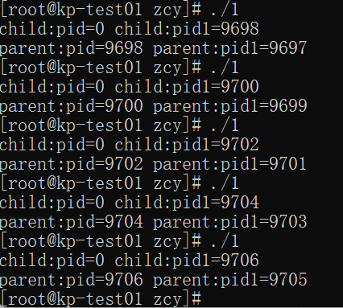

2.删去wait( )多次运行

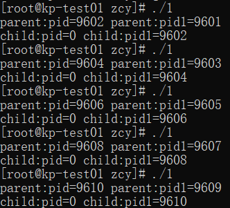

**分析：由运行结果分析可知，当保留wait(NULL)时，父进程会等待子进程程序运行结束再进行，所以是子进程先结束，然后父进程才会结束；而当删去wait(NULL)之后，父进程不必等待子进程，因此父进程先结束，子进程后结束。**

3.修改代码，增加一个全局变量并在父子进程中对其进行不同的操作
```c
int value=0;
int main()
{
        pid_t pid,pid1;
        pid=fork();
        if(pid<0){
                fprintf(stderr,"Fork Failed");
                return 1;
                }
        else if(pid==0){
                printf("child:value=%d ",++value);
                printf("child:&value=%d  ",&value);
                }
        else {
                printf("parent:value=%d ",--value);
                printf("parent:&value=%d  ",&value);
                }
        printf("\n");
        return 0;
}
```
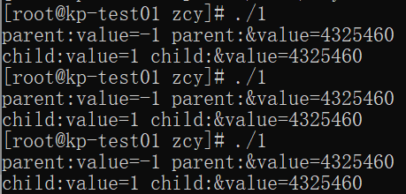

**解释：fork时，子进程拷贝父进程的数据空间中value值，此时父子进程中value都为0；然后父进程中value--得到-1，子进程中value++得到1，这说明父子进程数据空间的内容是相互独立的；同时可以发现父子进程中value的虚拟地址是相同的，这是为了保证子进程中依旧可以使用原程序中的指针、函数、寻址变量等数据或功能。**

4.在 return 前增加对全局变量的操作并输出结果
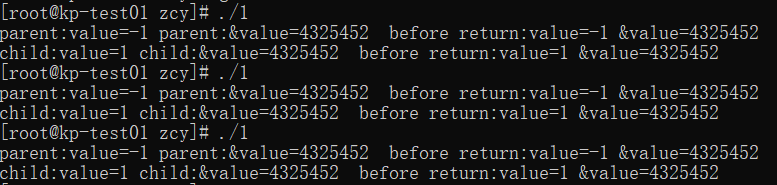
```c
int value=0;
int main()
{
    pid_t pid,pid1;
    pid=fork();
    if(pid<0){
        fprintf(stderr,"Fork Failed");
        return 1;
        }
    else if(pid==0){
        printf("child:value=%d ",++value);
        printf("child:&value=%d  ",&value);
        }
   else {
        printf("parent:value=%d ",--value);
        printf("parent:&value=%d  ",&value);
        }
    printf("before return:value=%d &value=%d\n",value,&value);
    return 0;
}
```
**解释：由结果可知，fork()之后父子进程直至结束前数据空间都是独立的，而其虚拟地址是相同的。**

5.在子进程中调用 system()与 exec 族函数。编写system_call.c 文件输出进程号 PID，编译后生成 system_call 可执行文件。在子进程中调用 system_call,观察输出结果并分析总结。

system_call
```c
#include <stdio.h>
#include <unistd.h>
int main()
{
    pid_t pid;
    pid=getpid();
    printf("\n system_call PID:%d\n",pid);
}
```

调用system()
```c
int main()
{
    pid_t pid,pid1;
    pid=fork();
    if(pid<0){
        fprintf(stderr,"Fork Failed");
        return 1;
        }
    else if(pid==0){
        pid1=getpid();
        printf("child process PID:%d ",pid1);
        if(system("./system_call")==-1){
            printf("system() failed");
            perror("why failed");
            }
        }
    else {
        pid1=getpid();
        printf("parent process PID:%d\n",pid1);
        printf("child process1 PID:%d ",pid);
        }
    printf("\n");
    return 0;
}
```

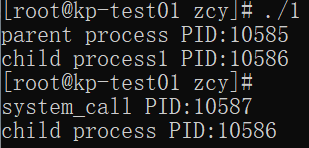

调用execl()
```c
int main()
{
    pid_t pid,pid1;
    pid=fork();
    if(pid<0){
        fprintf(stderr,"Fork Failed");
        return 1;
        }
    else if(pid==0){
        pid1=getpid();
        printf("child process1 PID:%d ",pid1);
        if(execl("./system_call","system_call",NULL,NULL)==-1){
            printf("execl failed");
            perror("why failed");
            }
        }
    else {
        pid1=getpid();
        printf("parent process PID:%d\n",pid1);
        printf("child process1 PID:%d ",pid);
        }
    printf("\n");
    return 0;
}
```
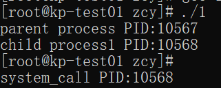

**解释：由结果可知及相关知识可知，system()函数运行参数命令时会创建一个新的子进程这个子进程有自己专门的pid，函数创建的子进程结束后会继续执行原来的进程；而execl()函数不会创建新的子进程，而是将该进程完全替换为新进程，因此既不会产生新的pid，也不会在execl()执行完后继续执行原来的进程。**

参考资料：[Linux系统学习——exec族函数、system函数、popen函数学习](https://blog.csdn.net/chinesekobe/article/details/107281995)
## 1.2 线程相关编程实验
### 实验步骤
1.设计程序，创建两个子线程，两线程分别对同一个共享变量多次操
作，观察输出结果

遇到的问题：每次输出都为0，并且线程2并没有正常创建，程序也不报错
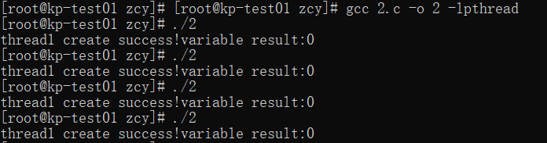

解决：经过调试后发现是因为主线程结束过快,没有等待线程结束。后查阅资料后加上pthread_join函数即可
<br>最终代码如下:

```c
int value=0;

void* thread1(void* arg)
{
    printf("thread1 create success!");

    int i=0;
    for(i=0;i<100000;i++){
        value+=100;
    }
    return NULL;
}

void* thread2(void* arg)
{
    printf("thread2 create success!");
    int i=0;
    for(i=0;i<100000;i++){
        value-=100;
    }
    return NULL;
}

int main()
{
    pthread_t tid1,tid2;
    int ret1,ret2;
    
    ret1=pthread_create(&tid1,NULL,thread1,NULL);
    if(ret1!=0){printf("thread1 create failed!\n");}
    ret2=pthread_create(&tid2,NULL,thread2,NULL);
    if(ret2!=0){printf("thread2 create failed!\n");}
    
    pthread_join(tid1, NULL);
    pthread_join(tid2, NULL);
    printf("variable result:%d\n",value);
    return 0;
}
```
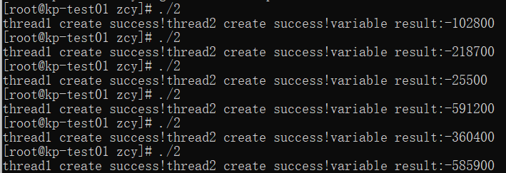

**分析：在同一个进程中的两个线程并发执行，并且同时调用共享资源value并对其数值进行操作，就会导致竞争现象的出现，不同线程的操作交叉执行，导致结果不稳定，每次运行会得到不同的结果。**

2.修改程序，定义信号量 signal，使用 PV 操作实现共享变量的访问
与互斥。运行程序，观察最终共享变量的值。
```c
int value=0;
pthread_mutex_t signal;

void* thread1(void* arg)
{
    printf("thread1 create success!");
    int i=0;
    for(i=0;i<100000;i++){
        pthread_mutex_lock(&signal);//P
        value+=100;
        pthread_mutex_unlock(&signal);//V
    }
    return NULL;
}

void* thread2(void* arg)
{
    printf("thread2 create success!");
    int i=0;
    for(i=0;i<100000;i++){
        pthread_mutex_lock(&signal);//P
        value-=100;
        pthread_mutex_unlock(&signal);//V
    }
    return NULL;
}

int main()
{
    pthread_t tid1,tid2;
    int ret1,ret2;
    pthread_mutex_init(&signal,NULL);
    pthread_mutex_unlock(&signal);

    ret1=pthread_create(&tid1,NULL,thread1,NULL);
    if(ret1!=0){printf("thread1 create failed!\n");}
    ret2=pthread_create(&tid2,NULL,thread2,NULL);
    if(ret2!=0){printf("thread2 create failed!\n");}
    
    pthread_join(tid1, NULL);
    pthread_join(tid2, NULL);
    printf("variable result:%d\n",value);
    
    return 0;
}
```
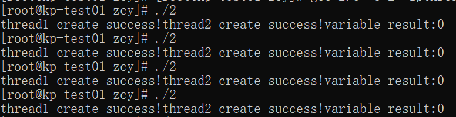

3.在第一部分实验了解了 system()与 exec 族函数的基础上，将这两个函数的调用改为在线程中实现，输出进程 PID 和线程的 TID 进行分析。

system_call
```c
int main()
{
    printf("system_call PID:%d\n",getpid());
}
```

system()

```c
void* thread1(void* arg)
{
    printf("thread1 create success!\n");
    printf("thread1 tid=%d,pid=%d\n",syscall(__NR_gettid),getpid());
    system("./system_call\n");
    printf("thread1 systemcall return\n");
    return NULL;
}

void* thread2(void* arg)
{
    printf("thread2 create success!\n");
    printf("thread2 tid=%d,pid=%d\n",syscall(__NR_gettid),getpid());
    system("./system_call\n");
    printf("thread2 systemcall return\n");
    return NULL;
}

int main()
{
    pthread_t tid1,tid2;
    int ret1,ret2;

    ret1=pthread_create(&tid1,NULL,thread1,NULL);
    if(ret1!=0){printf("thread1 create failed!\n");}
    ret2=pthread_create(&tid2,NULL,thread2,NULL);
    if(ret2!=0){printf("thread2 create failed!\n");}
    
    pthread_join(tid1, NULL);
    pthread_join(tid2, NULL);
    return 0;
}
```
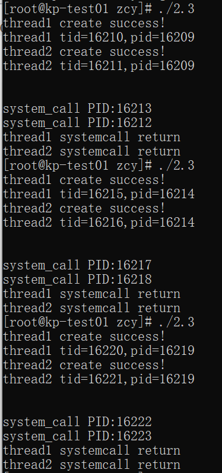

**分析：同一个进程中每个线程都占有独立的TID，不同线程之间的TID不同；而同一进程中的两个不同线程输出进程号PID时，因为他们在同一个进程中所以PID是相同的。**

execl()

```c
void* thread1(void* arg)
{
    printf("thread1 create success!\n");
    printf("thread1 tid=%d,pid=%d\n",syscall(__NR_gettid),getpid());
    if(execl("./system_call","system_call",NULL,NULL)==-1){
            printf("thread1 execl failed");
            }
    printf("thread1 systemcall return\n");
    return NULL;
}

void* thread2(void* arg)
{
    printf("thread2 create success!\n");
    printf("thread2 tid=%d,pid=%d\n",syscall(__NR_gettid),getpid());
    if(execl("./system_call","system_call",NULL,NULL)==-1){
            printf("thread2 execl failed");
            }
    printf("thread2 systemcall return\n");
    return NULL;
}

int main()
{
    pthread_t tid1,tid2;
    int ret1,ret2;
    // 创建线程
    ret1=pthread_create(&tid1,NULL,thread1,NULL);
    if(ret1!=0){printf("thread1 create failed!\n");}
    ret2=pthread_create(&tid2,NULL,thread2,NULL);
    if(ret2!=0){printf("thread2 create failed!\n");}
    // 等待线程结束
    pthread_join(tid1, NULL);
    pthread_join(tid2, NULL);
    return 0;
}
```
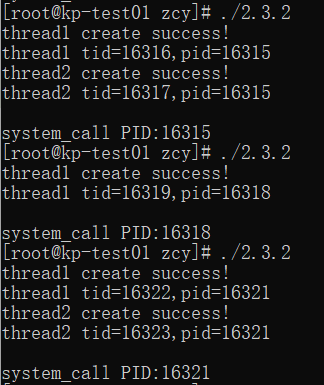

**对比分析：system()函数运行时会创建一个新的子进程这个子进程有自己专门的pid，函数创建的子进程结束后会继续执行原来的进程；而execl()函数不会创建新的子进程，而是将该进程完全替换为新进程，因此既不会产生新的pid，也不会在execl()执行完后继续执行原来的进程。**

## 1.3 自旋锁实验
### 实验步骤
1.根据实验内容要求，编写模拟自旋锁程序代码 spinlock.c
```c
#include <stdio.h>
#include <pthread.h>
// 定义自旋锁结构体
typedef struct {
 int flag;
} spinlock_t;
// 初始化自旋锁
void spinlock_init(spinlock_t *lock) {
 lock->flag = 0;
}
// 获取自旋锁
void spinlock_lock(spinlock_t *lock) {
    while (__sync_lock_test_and_set(&lock->flag, 1)) {
    //自旋等待
    }
}
// 释放自旋锁
void spinlock_unlock(spinlock_t *lock) {
    __sync_lock_release(&lock->flag);
}
// 共享变量
int shared_value = 0;
// 线程函数
void *thread_function(void *arg) {
 spinlock_t *lock = (spinlock_t *)arg;
 for (int i = 0; i < 5000; ++i) {
 spinlock_lock(lock);
 shared_value++;
 spinlock_unlock(lock);
 }
 return NULL;
}

int main() {
 pthread_t thread1, thread2;
 spinlock_t lock;
 int ret1,ret2;
// 输出共享变量的值
printf("shared_value=%d\n",shared_value);
 // 初始化自旋锁
 spinlock_init(&lock);
 // 创建两个线程
ret1=pthread_create(&thread1,NULL,thread_function,(void*)&lock);
if(ret1!=0){printf("thread1 create failed!\n");}
else{printf("thread1 create success!\n");}
ret2=pthread_create(&thread2,NULL,thread_function,(void*)&lock);
if(ret2!=0){printf("thread2 create failed!\n");}
else{printf("thread2 create success!\n");}
 //等待线程结束
pthread_join(thread1, NULL);
pthread_join(thread2, NULL);
 //输出共享变量的值
 printf("shared_value=%d\n",shared_value);
 return 0;
}
```
2.补充完成代码后，编译并运行程序，分析运行结果
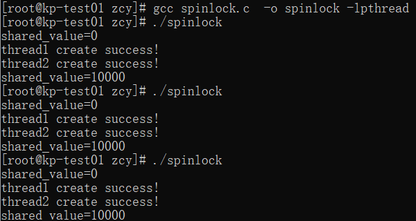

**分析：由于自旋锁的存在，当某个线程操作共享变量的时候会给共享变量加锁，此时其他线程想要操作共享变量时会进行自旋等待，由此避免了多个线程同时操作造成竞争现象。**