# 类EXT2文件系统的设计

## 一、运行结果

1.初始化和登入login

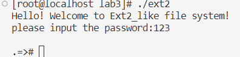

2.password修改密码

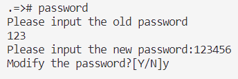

3.logout登出，并用新密码重新登入

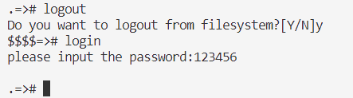

4.create创建目录/文件

目录
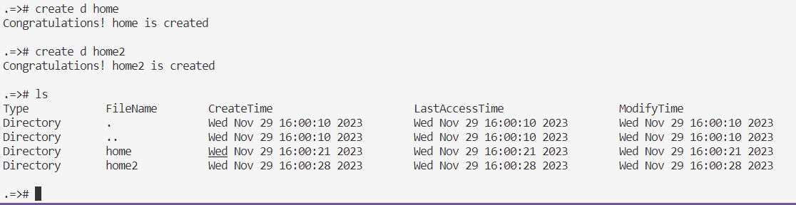

文件
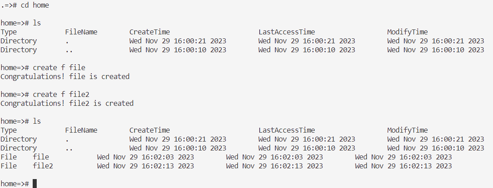

5.cd打开目录 close关闭目录

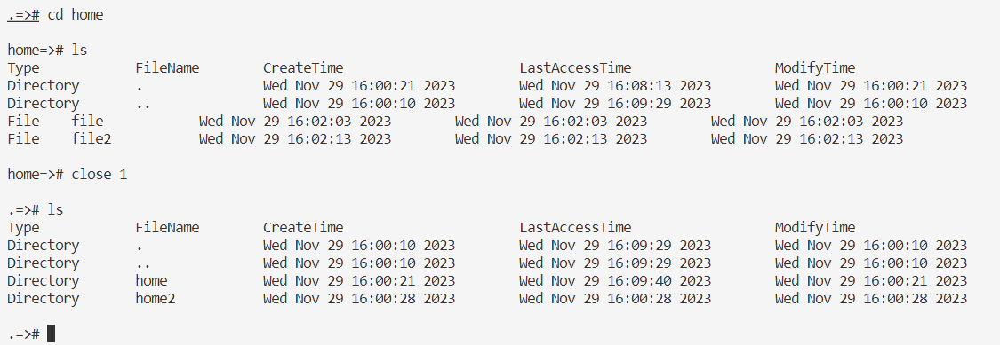

6.wirte写入文件

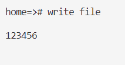

7.read读文件

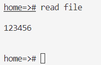

8.delete删除文件

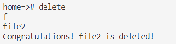

9.format初始化

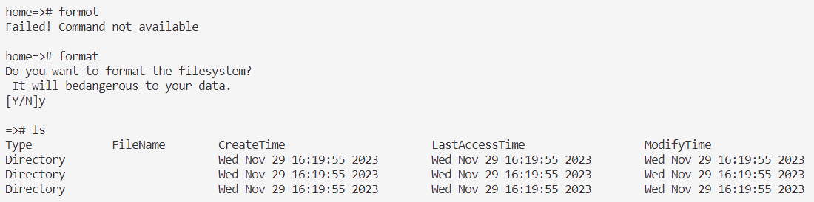

10.exit退出系统

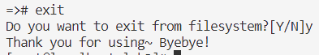