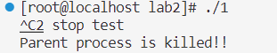
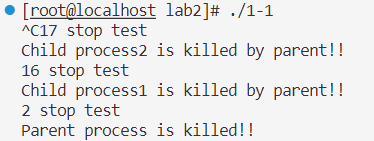
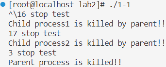
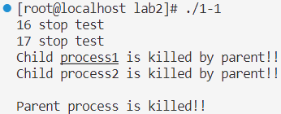
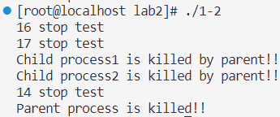
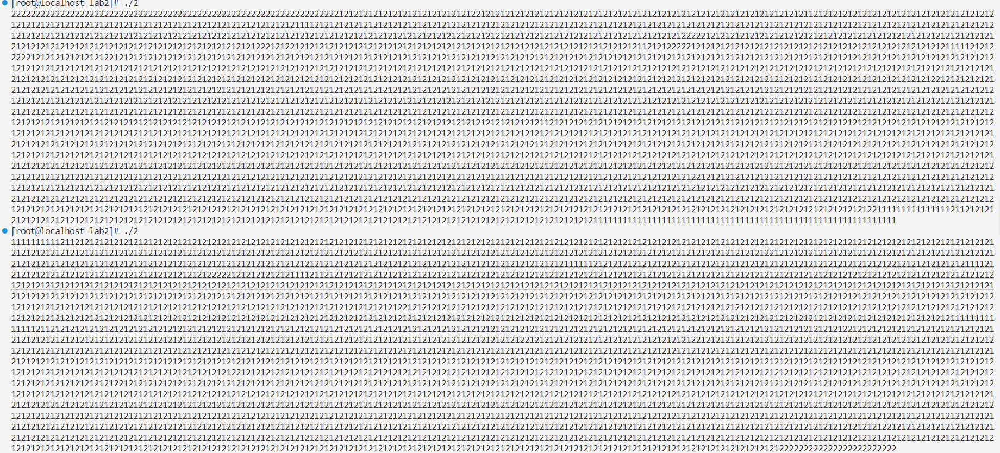

# 实验二 进程通信与内存管理
## 2.1 进程的软中断通信
### 1.根据流程图编制实现软中断通信的程序

**问题**：不输出子进程结束标志，只有父进程结束



解决：没有在两个子进程中忽略crtl+c和crtl+z信号，导致子进程直接结束，没有输出；只需要在两个子进程中添加signal(SIGINT,SIG_IGN);signal(SIGQUIT,SIG_IGN) 来将两个中止信号忽略掉。

最终解决问题后代码如下：
```c
typedef void (*sighandler_t)(int);
int flag=1;
void handler(int sig){
    printf("%d stop test",sig);
    flag=0;
}
int main() {
    pid_t pid1=-1, pid2=-1;
    while (pid1 == -1)pid1=fork();
    if (pid1 > 0) {
        while (pid2 == -1)pid2=fork();
        if (pid2 > 0) {            //父进程
            signal(SIGINT,handler);
            signal(SIGQUIT,handler);
            sleep(5);
            kill(pid1,16);
            kill(pid2,17);
            wait(0);
            wait(0);
            printf("\nParent process is killed!!\n");
        } else {                 //子进程2
        signal(SIGINT,SIG_IGN);
        signal(SIGQUIT,SIG_IGN);  
        signal(17,handler);
        while(flag==1);
        printf("\nChild process2 is killed by parent!!\n");
        return 0;
        }
    } else {                       //子进程1   
    signal(SIGINT,SIG_IGN);
    signal(SIGQUIT,SIG_IGN);          
    signal(16,handler);
    while(flag==1);
    printf("\nChild process1 is killed by parent!!\n");
    return 0;
    }
    return 0;
}
```

运行结果：
<br>手动crtl+c



手动crtl+\



等待5s自动停止



**分析：5s内手动crtl+c时，会向中断挂起状态，然后向两个子进程分别发送16和17信号，两个子进程接收对应信号后，flag变为0，中断等待状态，继续运行至结束，父进程待到两个子进程都结束后，也运行结束；如果等待5s，直至sleep(5)所导致的挂起状态结束，父进程就会自动按顺序向下运行，后续过程与手动结束相同。**

### 2.通过 14 号信号值进行闹钟中断

```c
typedef void (*sighandler_t)(int);
int flag=1;
void handler(int sig){
    printf("%d stop test",sig);
    flag=0;
}
int main() {
    pid_t pid1=-1, pid2=-1;
    while (pid1 == -1)pid1=fork();
    if (pid1 > 0) {
        while (pid2 == -1)pid2=fork();
        if (pid2 > 0) {                //父进程
            signal(SIGALRM,handler);   
            alarm(5);             //5s计时器
            while(flag==1);
            kill(pid1,16);
            kill(pid2,17);
            wait(0);
            wait(0);
            printf("\nParent process is killed!!\n");
        }  else {                      //子进程2 
        signal(17,handler);
        while(flag==1);
        printf("\nChild process2 is killed by parent!!\n");
        return 0;
        }
    } else {                        //子进程1            
    signal(16,handler);
    while(flag==1);
    printf("\nChild process1 is killed by parent!!\n");
    return 0;
    }
    return 0;
}
```



**分析：父进程设置了一个5s的计时器，当计时器结束时会向父进程发送一个闹钟中断信号SIGALRM，父进程捕捉到这个信号后执行相关函数，继续向下执行，后续过程与1-1相同。**

## 2.2 进程的管道通信
### 1.有锁
```c
#include <unistd.h> 
#include <signal.h> 
#include <stdio.h> 
#include <string.h>
#include <stdlib.h>
#include <sys/wait.h>
#define N 2000
int pid1,pid2; // 定义两个进程变量
int main(){
    int fd[2],i; 
    char InPipe[N+N+1]; // 定义读缓冲区
    char c1='1', c2='2'; 
    pipe(fd); // 创建管道
    while((pid1 = fork( )) == -1); 
    if(pid1 == 0) {                                 //子进程 1 
        lockf(fd[1],1,0); 
        for(i=0;i<N;i++) write(fd[1],&c1,1);// 分 2000 次每次向管道写入字符’1’ 
        sleep(5); 
        lockf(fd[1],0,0); 
        exit(0); 
    } else { 
        while((pid2 = fork()) == -1); 
        if(pid2 == 0) {                             //子进程2
            lockf(fd[1],1,0); 
            for(i=0;i<N;i++) write(fd[1],&c2,1);// 分 2000 次每次向管道写入字符’2’ 
            sleep(5); 
            lockf(fd[1],0,0); 
            exit(0); 
        } else {                                      //父进程
            wait(0);// 等待子进程 1 结束
            wait(0); // 等待子进程 2 结束
            read(fd[0],InPipe,N+N);// 从管道中读出 4000 个字符
            InPipe[N+N]='\0';// 加字符串结束符
            printf("%s\n",InPipe); // 显示读出的数据
            exit(0); // 父进程结束
        } 
    }
}
```

### 2.无锁
```c
#include <unistd.h> 
#include <signal.h> 
#include <stdio.h> 
#include <string.h>
#include <stdlib.h>
#include <sys/wait.h>
#define N 2000
int pid1,pid2; // 定义两个进程变量
int main(){
    int fd[2],i; 
    char InPipe[N+N+1]; // 定义读缓冲区
    char c1='1', c2='2'; 
    pipe(fd); // 创建管道
    while((pid1 = fork( )) == -1); 
    if(pid1 == 0) {                                 //子进程 1 
        // lockf(fd[1],1,0); 
        for(i=0;i<N;i++) write(fd[1],&c1,1);// 分 2000 次每次向管道写入字符’1’ 
        sleep(5); 
        // lockf(fd[1],0,0); 
        exit(0); 
    } 
    else { 
        while((pid2 = fork()) == -1); 
        if(pid2 == 0) {                             //子进程2
            // lockf(fd[1],1,0); 
            for(i=0;i<N;i++) write(fd[1],&c2,1);// 分 2000 次每次向管道写入字符’2’ 
            sleep(5); 
            // lockf(fd[1],0,0); 
            exit(0); 
        } 
        else {                                      //父进程
            wait(0);// 等待子进程 1 结束
            wait(0); // 等待子进程 2 结束
            read(fd[0],InPipe,N+N);// 从管道中读出 4000 个字符
            InPipe[N+N]='\0';// 加字符串结束符
            printf("%s\n",InPipe); // 显示读出的数据
            exit(0); // 父进程结束
        } 
    }
}
```


**分析：由结果来看，有锁时会随机选择写入2000个‘1’或者2000个‘2’，这个选择是随机的，但是一旦开始写入就会等2000个‘1’或者2000个‘2’全部写入之后才会写入另外一个，这是因为子进程在写入之前给管道加锁，等写入完成后才给管道解锁，加锁期间另一个进程无法进行写入；而无锁的时候下一个写入的字符完全是随机的，有可能是‘1’也可能是‘2’，因为不加锁管道对两个进程同时都是开放的，在某一个进程通过管道写入的时候，此时如果另一个进程要写入，就会进入等待队列，一旦管道空闲就会立即写入，所以最终结果是随机的。**

## 2.3 内存的分配与回收
### 1.内存分配管理的三种算法（FF，BF，WF）
#### (1)FF
```c
void rearrange_FF(){ 
    struct free_block_type *tmp,*cur,*pre,*dummy; 
    if(!free_block||!free_block->next) return;  //如果空闲块少于两个就不用排序
    dummy=(struct free_block_type *)malloc(sizeof(struct free_block_type));
    dummy->next = free_block;
    pre = free_block; // 当前节点的前驱
    cur = free_block->next;
    while(cur != NULL){
        tmp = dummy;
        if(pre->start_addr >= cur->start_addr){ //需要进行插入
            while(tmp->next->start_addr < cur->start_addr) //从第一个节点开始寻找插入位置
                tmp = tmp->next; // cur应该插入在tmp后面
            pre->next = cur->next; //断开节点cur
            cur->next = tmp->next; //插入
            tmp->next = cur;
            cur = pre->next; //继续处理下一个节点
        }
        else{ //无需插入
            pre = pre->next;
            cur = cur->next;
        }
    }
    free_block=dummy->next;
}
```
#### (2)BF
```c
void rearrange_BF(){
    struct free_block_type *tmp,*cur,*pre,*dummy; 
    if(!free_block||!free_block->next) return;  //如果空闲块少于两个就不用排序
    dummy=(struct free_block_type *)malloc(sizeof(struct free_block_type));
    dummy->next = free_block;
    pre = free_block; // 当前节点的前驱
    cur = free_block->next;
    while(cur != NULL){
        tmp = dummy;
        if(pre->size >= cur->size){ //需要进行插入
            while(tmp->next->size < cur->size) //从第一个节点开始寻找插入位置
                tmp = tmp->next; // cur应该插入在tmp后面
            pre->next = cur->next; //断开节点cur
            cur->next = tmp->next; //插入
            tmp->next = cur;
            cur = pre->next; //继续处理下一个节点
        }
        else{ //无需插入
            pre = pre->next;
            cur = cur->next;
        }
    }
    free_block=dummy->next;
}
```
#### (3)WF
```c
void rearrange_WF(){
    struct free_block_type *tmp,*cur,*pre,*dummy; 
    if(!free_block||!free_block->next) return;  //如果空闲块少于两个就不用排序
    dummy=(struct free_block_type *)malloc(sizeof(struct free_block_type));
    dummy->next = free_block;
    pre = free_block; // 当前节点的前驱
    cur = free_block->next;
    while(cur != NULL){
        tmp = dummy;
        if(pre->size <= cur->size){ //需要进行插入
            while(tmp->next->size > cur->size) //从第一个节点开始寻找插入位置
                tmp = tmp->next; // cur应该插入在tmp后面
            pre->next = cur->next; //断开节点cur
            cur->next = tmp->next; //插入
            tmp->next = cur;
            cur = pre->next; //继续处理下一个节点
        }
        else{ //无需插入
            pre = pre->next;
            cur = cur->next;
        }
    }
    free_block=dummy->next;
}
```
### 2.分配内存模块
```c
/*分配内存模块*/
int allocate_mem(struct allocated_block *ab){
    struct free_block_type *fbt,*pre,*work;
    int request_size=ab->size;
    fbt = free_block;
    pre = free_block;
    int sum=0;
    while(fbt!=NULL && fbt->size < request_size ){   //按顺序寻找是否有合适的空闲区
        sum+=fbt->size;
        pre=fbt;
        fbt=fbt->next;
        } 
    if(fbt==NULL && sum < request_size) return -1; //没有合适的空闲区，剩余空闲区之和也不够
    else if(fbt==NULL){        //没有合适的空闲区，剩余空闲区之和足够，内存紧缩       
        free_block->start_addr=0;              
        free_block->size=sum;                  //形成新的空闲区      
        int sumt=sum;
        fbt=free_block->next;
        while(fbt!=NULL) {
            work=fbt;
            fbt=fbt->next;
            free(work);
        }                                     //释放掉原来的空闲区链表
        free_block->next=NULL;
        struct allocated_block *abt=allocated_block_head; 
        while(abt!=NULL){                   //调整进程区的地址
            abt->start_addr=sumt;
            sumt+=abt->size;
            abt=abt->next;
        }
        fbt=free_block;
        pre=free_block;
    }
    if(fbt->size - request_size > MIN_SLICE){  //剩余空间足够大
        ab->start_addr=fbt->start_addr;
        fbt->start_addr+=ab->size;
        fbt->size-=ab->size;
    }
    else{                                      //剩余空间比较小
        ab->start_addr=fbt->start_addr;
        ab->size=fbt->size;
        pre->next=fbt->next;
        if(pre==fbt) free_block=pre->next;
        free(fbt);
    }   
    rearrange(ma_algorithm);
    return 1;
}
```
### 3.分配区回收模块
```c
int free_mem(struct allocated_block *ab){
    void display_mem_usage();
    struct free_block_type *fbt, *pre;
    fbt=(struct free_block_type*)malloc(sizeof(struct free_block_type));
    if(!fbt) return -1;

    fbt->size=ab->size;
    fbt->start_addr=ab->start_addr;
    fbt->next=free_block;// 1. 将新释放的结点插入到空闲分区队列末尾
    free_block=fbt;

    rearrange_FF();// 2. 对空闲链表按照地址有序排列
    
    fbt=free_block;// 3. 检查并合并相邻的空闲分区
    pre=free_block;
    while(fbt!=NULL){
        if(pre->start_addr+pre->size==fbt->start_addr){
            pre->next=fbt->next;
            pre->size+=fbt->size;
            free(fbt);
            fbt=pre->next;
        }
        else{
            pre=fbt;
            fbt=fbt->next;
        }
    }
    rearrange(ma_algorithm);// 4. 将空闲链表重新按照当前算法排序
    return 1;
}
```
### 4.释放链表并退出do_exit()
```c
void do_exit(){
    struct free_block_type *fbt;
    struct allocated_block *ab;
    while(free_block!=NULL){
        fbt=free_block;
        free_block=free_block->next;
        free(fbt);
    }
    while(allocated_block_head!=NULL){
        ab=allocated_block_head;
        allocated_block_head=allocated_block_head->next;
        free(ab);
    }
}
```
### 5.完整代码
```c
#include <stdio.h> 
#include <string.h>
#include <stdlib.h>
#include <unistd.h> 
#define PROCESS_NAME_LEN 32 /*进程名长度*/
#define MIN_SLICE 10 /*最小碎片的大小*/
#define DEFAULT_MEM_SIZE 1024 /*内存大小*/
#define DEFAULT_MEM_START 0 /*起始位置*/
/* 内存分配算法 */
#define MA_FF 1
#define MA_BF 2
#define MA_WF 3
int mem_size=DEFAULT_MEM_SIZE; /*内存大小*/
int ma_algorithm = MA_FF; /*当前分配算法*/
static int pid = 0; /*初始 pid*/
int flag = 0; /*设置内存大小标志*/
/*空闲块*/
struct free_block_type{
    int size;
    int start_addr;
    struct free_block_type *next;
}; 
/*指向内存中空闲块链表的首指针*/
struct free_block_type *free_block;
/*每个进程分配到的内存块的描述*/
struct allocated_block{
    int pid; 
    int size;
    int start_addr;
    char process_name[PROCESS_NAME_LEN];
    struct allocated_block *next;
};
/*进程分配内存块链表的首指针*/
struct allocated_block *allocated_block_head = NULL;
/*初始化空闲块，默认为一块，可以指定大小及起始地址*/
struct free_block_type* init_free_block(int mem_size){
    struct free_block_type *fb;
    fb=(struct free_block_type *)malloc(sizeof(struct free_block_type));
    if(fb==NULL){printf("No mem\n");return NULL;}
    fb->size = mem_size;
    fb->start_addr = DEFAULT_MEM_START;
    fb->next = NULL;
    return fb;
}
/*显示菜单*/
void display_menu(){
    printf("\n");
    printf("1 - Set memory size (default=%d)\n", DEFAULT_MEM_SIZE);
    printf("2 - Select memory allocation algorithm\n");
    printf("3 - New process \n");
    printf("4 - Terminate a process \n");
    printf("5 - Display memory usage \n");
    printf("0 - Exit\n");
}
/*设置内存的大小*/
int set_mem_size(){
    int size;
    if(flag!=0){ //防止重复设置
        printf("Cannot set memory size again\n");
        return 0;
    }
    printf("Total memory size =");
    scanf("%d", &size);
    if(size>0) {
        mem_size = size;
        free_block->size = mem_size;
    }
    flag=1; 
    return 1;
}
/*按 FF 算法重新整理内存空闲块链表*/ 
void rearrange_FF(){ 
    struct free_block_type *tmp,*cur,*pre,*dummy; 
    if(!free_block||!free_block->next) return;  //如果空闲块少于两个就不用排序
    dummy=(struct free_block_type *)malloc(sizeof(struct free_block_type));
    dummy->next = free_block;
    pre = free_block; // 当前节点的前驱
    cur = free_block->next;
    while(cur != NULL){
        tmp = dummy;
        if(pre->start_addr >= cur->start_addr){ //需要进行插入
            while(tmp->next->start_addr < cur->start_addr) //从第一个节点开始寻找插入位置
                tmp = tmp->next; // cur应该插入在tmp后面
            pre->next = cur->next; //断开节点cur
            cur->next = tmp->next; //插入
            tmp->next = cur;
            cur = pre->next; //继续处理下一个节点
        }
        else{ //无需插入
            pre = pre->next;
            cur = cur->next;
        }
    }
    free_block=dummy->next;
}
/*按 BF 算法重新整理内存空闲块链表*/
void rearrange_BF(){
    struct free_block_type *tmp,*cur,*pre,*dummy; 
    if(!free_block||!free_block->next) return;  //如果空闲块少于两个就不用排序
    dummy=(struct free_block_type *)malloc(sizeof(struct free_block_type));
    dummy->next = free_block;
    pre = free_block; // 当前节点的前驱
    cur = free_block->next;
    while(cur != NULL){
        tmp = dummy;
        if(pre->size >= cur->size){ //需要进行插入
            while(tmp->next->size < cur->size) //从第一个节点开始寻找插入位置
                tmp = tmp->next; // cur应该插入在tmp后面
            pre->next = cur->next; //断开节点cur
            cur->next = tmp->next; //插入
            tmp->next = cur;
            cur = pre->next; //继续处理下一个节点
        }
        else{ //无需插入
            pre = pre->next;
            cur = cur->next;
        }
    }
    free_block=dummy->next;
}
/*按 WF 算法重新整理内存空闲块链表*/
void rearrange_WF(){
    struct free_block_type *tmp,*cur,*pre,*dummy; 
    if(!free_block||!free_block->next) return;  //如果空闲块少于两个就不用排序
    dummy=(struct free_block_type *)malloc(sizeof(struct free_block_type));
    dummy->next = free_block;
    pre = free_block; // 当前节点的前驱
    cur = free_block->next;
    while(cur != NULL){
        tmp = dummy;
        if(pre->size <= cur->size){ //需要进行插入
            while(tmp->next->size > cur->size) //从第一个节点开始寻找插入位置
                tmp = tmp->next; // cur应该插入在tmp后面
            pre->next = cur->next; //断开节点cur
            cur->next = tmp->next; //插入
            tmp->next = cur;
            cur = pre->next; //继续处理下一个节点
        }
        else{ //无需插入
            pre = pre->next;
            cur = cur->next;
        }
    }
    free_block=dummy->next;
}
/*按指定的算法整理内存空闲块链表*/
void rearrange(int algorithm){
    switch(algorithm){
        case MA_FF: rearrange_FF(); break;
        case MA_BF: rearrange_BF(); break;
        case MA_WF: rearrange_WF(); break;
    }
}
/* 设置当前的分配算法 */
void set_algorithm(){
    int algorithm;
    printf("\t1 - First Fit\n");
    printf("\t2 - Best Fit \n");
    printf("\t3 - Worst Fit \n");
    scanf("%d", &algorithm);
    if(algorithm>=1 && algorithm <=3) ma_algorithm=algorithm;
    //按指定算法重新排列空闲区链表
    rearrange(ma_algorithm); 
}
/*分配内存模块*/
int allocate_mem(struct allocated_block *ab){
    struct free_block_type *fbt,*pre,*work;
    int request_size=ab->size;
    fbt = free_block;
    pre = free_block;
    int sum=0;
    while(fbt!=NULL && fbt->size < request_size ){   //按顺序寻找是否有合适的空闲区
        sum+=fbt->size;
        pre=fbt;
        fbt=fbt->next;
        } 
    if(fbt==NULL && sum < request_size) return -1; //没有合适的空闲区，剩余空闲区之和也不够
    else if(fbt==NULL){        //没有合适的空闲区，剩余空闲区之和足够，内存紧缩       
        free_block->start_addr=0;              
        free_block->size=sum;                  //形成新的空闲区      
        int sumt=sum;
        fbt=free_block->next;
        while(fbt!=NULL) {
            work=fbt;
            fbt=fbt->next;
            free(work);
        }                                     //释放掉原来的空闲区链表
        free_block->next=NULL;
        struct allocated_block *abt=allocated_block_head; 
        while(abt!=NULL){                   //调整进程区的地址
            abt->start_addr=sumt;
            sumt+=abt->size;
            abt=abt->next;
        }
        fbt=free_block;
        pre=free_block;
    }
    if(fbt->size - request_size > MIN_SLICE){  //剩余空间足够大
        ab->start_addr=fbt->start_addr;
        fbt->start_addr+=ab->size;
        fbt->size-=ab->size;
    }
    else{                                      //剩余空间比较小
        ab->start_addr=fbt->start_addr;
        ab->size=fbt->size;
        pre->next=fbt->next;
        if(pre==fbt) free_block=pre->next;
        free(fbt);
    }   
    rearrange(ma_algorithm);
    return 1;
}
/*创建新的进程，主要是获取内存的申请数量*/
void new_process(){
    struct allocated_block *ab;
    int size,ret=0; 
    ab=(struct allocated_block *)malloc(sizeof(struct allocated_block));
    if(!ab) exit(-5);
    ab->next = NULL;
    pid++;
    sprintf(ab->process_name, "PROCESS-%02d", pid);
    ab->pid = pid; 
    printf("Memory for %s:", ab->process_name);
    scanf("%d",&size);
    if(size>0) ab->size=size;
    ret = allocate_mem(ab); /* 从空闲区分配内存，ret==1 表示分配 ok*/
    /*如果此时 allocated_block_head 尚未赋值，则赋值*/
    if((ret==1) &&(allocated_block_head == NULL)){ 
        allocated_block_head=ab;
    }
    /*分配成功，将该已分配块的描述插入已分配链表*/
    else if(ret==1) {
        ab->next=allocated_block_head;
        allocated_block_head=ab;
    }
    else{ /*分配不成功*/
        printf("Allocation fail\n");
        free(ab); 
    }
}
/*将 ab 所表示的已分配区归还，并进行可能的合并*/
int free_mem(struct allocated_block *ab){
    void display_mem_usage();
    struct free_block_type *fbt, *pre;
    fbt=(struct free_block_type*)malloc(sizeof(struct free_block_type));
    if(!fbt) return -1;
    fbt->size=ab->size;
    fbt->start_addr=ab->start_addr;
    fbt->next=free_block;// 1. 将新释放的结点插入到空闲分区队列末尾
    free_block=fbt;
    rearrange_FF();// 2. 对空闲链表按照地址有序排列
    fbt=free_block;// 3. 检查并合并相邻的空闲分区
    pre=free_block;
    while(fbt!=NULL){
        if(pre->start_addr+pre->size==fbt->start_addr){
            pre->next=fbt->next;
            pre->size+=fbt->size;
            free(fbt);
            fbt=pre->next;
        }
        else{
            pre=fbt;
            fbt=fbt->next;
        }
    }
    rearrange(ma_algorithm);// 4. 将空闲链表重新按照当前算法排序
    return 1;
}
/*释放 ab 数据结构节点*/
void dispose(struct allocated_block *free_ab){
    struct allocated_block *pre, *ab;
    if(free_ab == allocated_block_head) { /*如果要释放第一个节点*/
        allocated_block_head = allocated_block_head->next;
        free(free_ab);
        return;
    }
    pre = allocated_block_head; 
    ab = allocated_block_head->next;
    while(ab!=free_ab){ pre = ab; ab = ab->next; }
    pre->next = ab->next;
    free(ab);
    return;
}
/*删除进程，归还分配的存储空间，并删除描述该进程内存分配的节点*/
void kill_process(){
    struct allocated_block *ab;
    int pid;
    if(allocated_block_head==NULL) {printf("No Process Need to Kill!\n");return;}//目前没有进程
    printf("Kill Process, pid=");
    scanf("%d", &pid);
    ab=allocated_block_head;
    while(ab!=NULL) { //find_process
        if(ab->pid==pid) break;
        ab=ab->next;
        }  
    if(ab!=NULL){
        free_mem(ab); /*释放 ab 所表示的分配区*/
        dispose(ab); /*释放 ab 数据结构节点*/
    }
    else printf("No Process Which Pid=%d", pid);
}
/* 显示当前内存的使用情况，包括空闲区的情况和已经分配的情况 */
void display_mem_usage(){
    struct free_block_type *fbt=free_block;
    struct allocated_block *ab=allocated_block_head;
    printf("----------------------------------------------------------\n");
    /* 显示空闲区 */
    printf("Free Memory:\n");
    printf("%20s %20s\n", " start_addr", " size");
    while(fbt!=NULL){
        printf("%20d %20d\n", fbt->start_addr, fbt->size);
        fbt=fbt->next;
    } 
    /* 显示已分配区 */
    printf("\nUsed Memory:\n");
    printf("%10s %20s %10s %10s\n", "PID", "ProcessName", "start_addr", " size");
    while(ab!=NULL){
        printf("%10d %20s %10d %10d\n", ab->pid, ab->process_name, 
        ab->start_addr, ab->size);
        ab=ab->next;
    }
    printf("----------------------------------------------------------\n");
    return;
}
void do_exit(){
    struct free_block_type *fbt;
    struct allocated_block *ab;
    while(free_block!=NULL){
        fbt=free_block;
        free_block=free_block->next;
        free(fbt);
    }
    while(allocated_block_head!=NULL){
        ab=allocated_block_head;
        allocated_block_head=allocated_block_head->next;
        free(ab);
    }
}
int main(){
    pid=0;
    int choice;
    free_block = init_free_block(mem_size); //初始化空闲区
    while(1) {
        display_menu(); //显示菜单
        fflush(stdin);
        scanf("%d",&choice); //获取用户输入
        switch(choice){
            case 1: set_mem_size(); break; //设置内存大小
            case 2: set_algorithm();flag=1; break;//设置算法
            case 3: new_process(); flag=1; break;//创建新进程
            case 4: kill_process(); flag=1; break;//删除进程
            case 5: display_mem_usage(); flag=1; break; //显示内存使用
            case 0: do_exit(); exit(0); //释放链表并退出
            default: printf("error");break; 
        } 
    } 
}
```